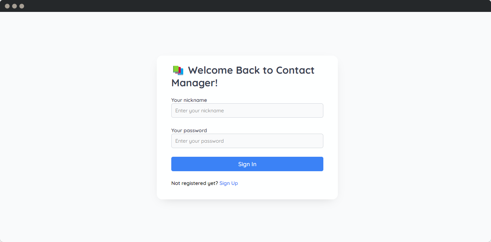
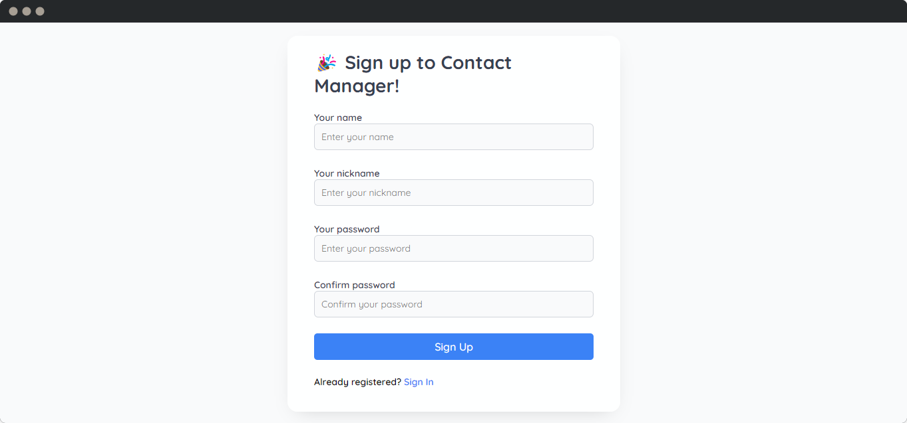
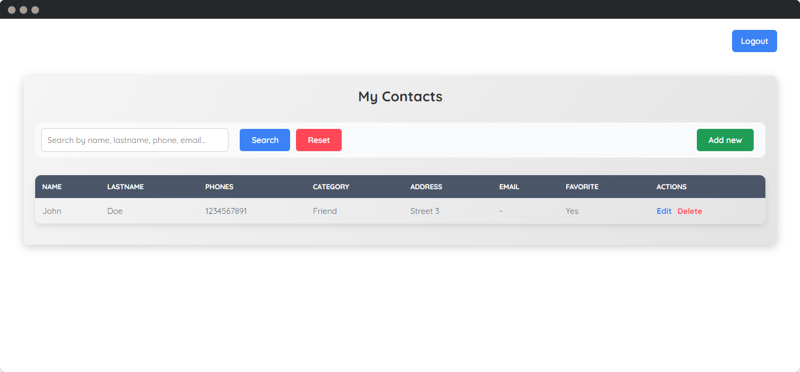
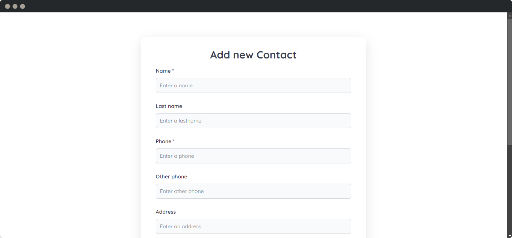

# Contact Management System


Welcome to the **Contact Management System**, your one-stop solution for managing all your contacts! Built using **Flask** and **SQLite3**, this application allows users to create accounts, log in, and effortlessly manage their contact information.

## Features ✨

### User Features (1️⃣)

- **User Registration**: Sign up in seconds and get started!
- **Login & Logout**: Securely access your account whenever you need to.
- **Manage Contacts**: Add, edit, search, and delete contacts with ease.
- **Flash Alerts**: Get real-time feedback on your actions with informative alerts for successful operations or errors.

---

## Technologies Used 🚀

- **Python** with **Flask** for backend development.
- **SQLite3** for lightweight and easy database management.
- **HTML & CSS** for a beautiful user interface.
- **Flask-Login** for managing user sessions.
- **Flask-Flash** for displaying alerts and notifications to users.

---

## Getting Started 🛠️

### Prerequisites

Make sure you have the following installed:

- [Python 3.8+](https://www.python.org/downloads/)

### Installation

1. **Create a Virtual Environment**: It's a good practice to create a virtual environment to manage dependencies. Run the following command:

    ```bash
    python -m venv venv
    ```

2. **Activate the Virtual Environment**:
    - On Windows:

        ```bash
        venv\Scripts\activate
        ```

    - On macOS/Linux:

        ```bash
        source venv/bin/activate
        ```

3. **Clone the repository**:

    ```bash
    git clone https://github.com/blandoncj/contact-management-system.git
    ```

4. **Navigate to the project directory**:

    ```bash
    cd contact-management-system
    ```

5. **Install the required dependencies**:

    ```bash
    pip install -r requirements.txt
    ```

6. **Run the application**:

    ```bash
    python app/main.py
    ```

---

## Screenshots 📸

### Login Page



### Signup Page



### Contacts Page



### Contact Form



---

## Database Schema 🗂️

The system uses a **relational database (SQLite3)** with the following main entities:

- **User**: Represents a user in the system.
- **Contact**: Represents a contact managed by a user.
- **ContactPhone**: Represents the phone numbers associated with each contact.

---

## Contribution Guidelines 🤝

Contributions are welcome! If you'd like to help improve this project, please follow these steps:

1. Fork the repository.
2. Create a new branch (`git checkout -b feature/new-feature`).
3. Commit your changes (`git commit -m 'Add a new feature'`).
4. Push to the branch (`git push origin feature/new-feature`).
5. Open a pull request.

---

## License 📝

This project is licensed under the MIT License. See the [LICENSE](LICENSE) file for details.

---

## Contact 📧

For any questions or feedback, feel free to reach out at:

- **Email**: <jacoboblandon94@gmail.com>
- **GitHub**: [blandoncj](https://github.com/blandoncj)

---

**Enjoy managing your contacts! 📇**
